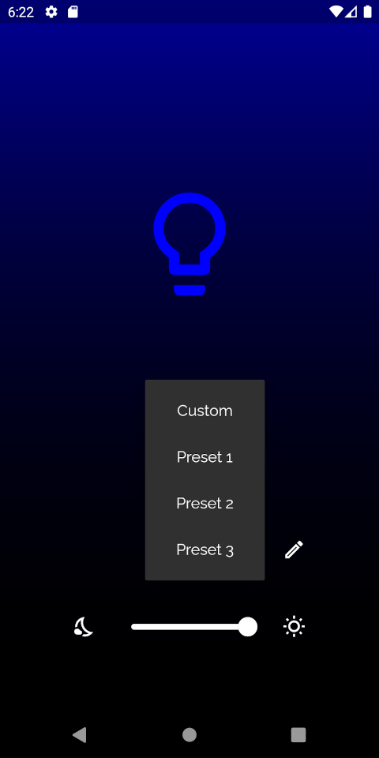
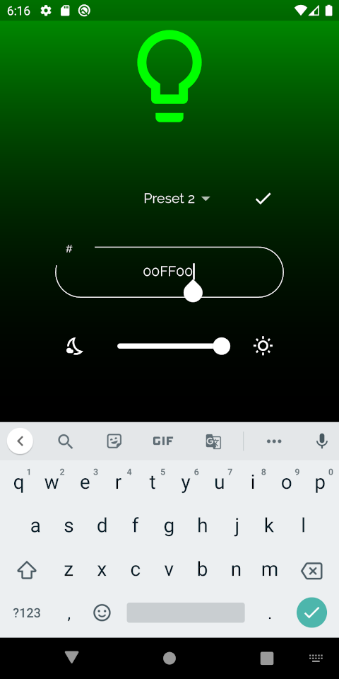
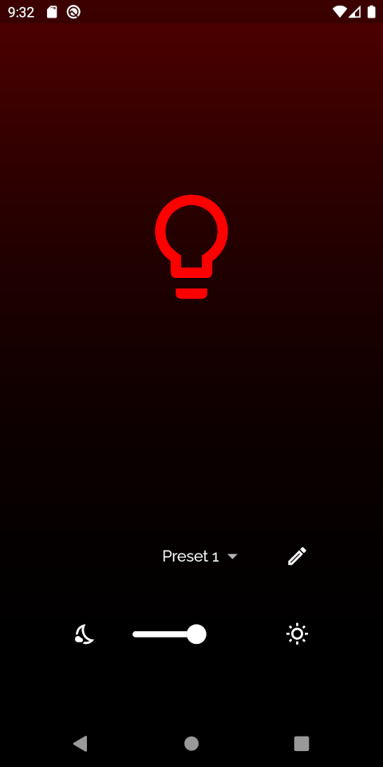
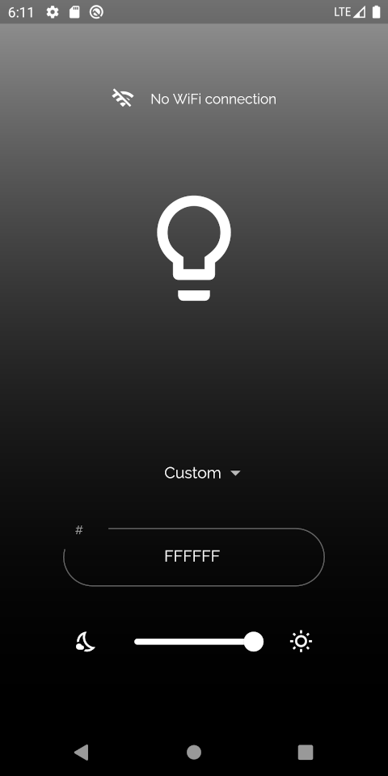

# flutter_rgb_leds

This [Flutter](https://flutter.dev/) project is a frontend application for controlling Adafruit RGB LEDs with a smartphone. This requires the corresponding backend application to be running on a Raspberry Pi within the same local network as the smartphone. The communication between phone and Raspberry Pi works via UDP packages. These UDP packages contain the desired RGB values of the LEDs as a JSON encoded array.

## User interface

+ To make it easier to switch between favorite colors, the app offers 3 color presets. These color presets can be edited at any time by pressing on the edit button: 

+ The brightness of the selected color can be adjusted by using the slider at the bottom of the screen. By tapping on the icons on either side of the slider, the brightness can be instantly set to 100% or 0%:

+ If the device is not connected to a WiFi network, a corresponding notification is shown at the top of the screen:

